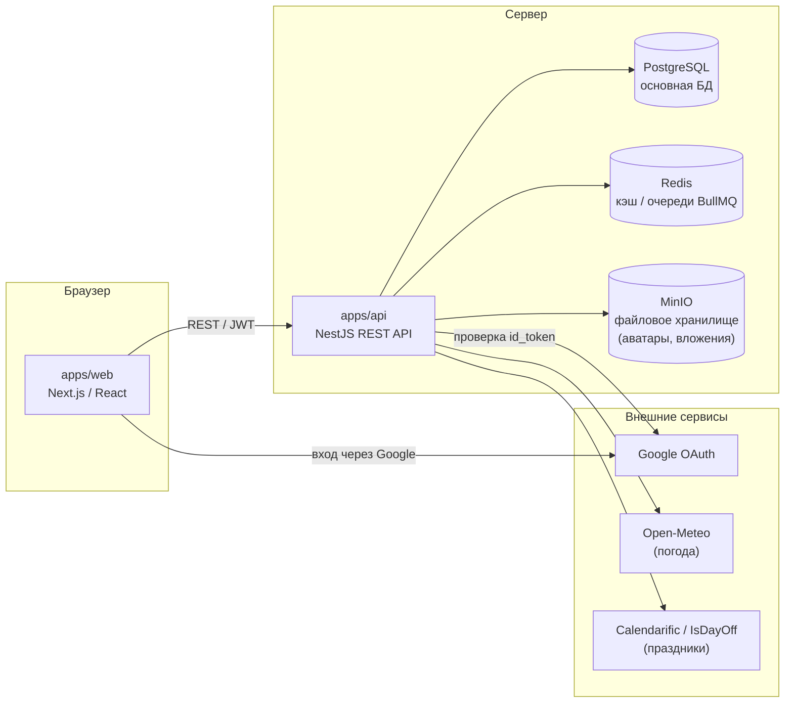

# Warmingtea

Веб-приложение для планирования и отслеживания задач: повторяющиеся задачи, привязка к погоде и праздникам, геймификация (достижения, монеты, магазин), уведомления и многое другое.

Полнастековый pnpm-монорепозиторий: фронтенд на Next.js (React) и бэкенд на NestJS с PostgreSQL, Redis и MinIO.

## Стек технологий

**Frontend (`apps/web`)**
- Next.js 16 / React 19
- TypeScript, SCSS (Sass)
- Zustand (стейт), TanStack Query (данные с сервера)
- React Hook Form + Zod (формы и валидация)
- Vitest (тесты)

**Backend (`apps/api`)**
- NestJS 11 (TypeScript)
- TypeORM + PostgreSQL
- Redis + BullMQ (очереди/фоновые задачи)
- MinIO (S3-совместимое файловое хранилище)
- Passport + JWT (аутентификация, включая Google OAuth)
- Swagger (`@nestjs/swagger`) — автогенерируемая документация API
- Jest (тесты)

**Инфраструктура**
- Docker / Docker Compose (Postgres, Redis, MinIO — для разработки и продакшена)
- pnpm workspaces (монорепозиторий)
- GitHub Actions (CI: lint, typecheck, тесты, сборка)
- husky + lint-staged (pre-commit проверки)

## Структура монорепозитория

```
diplom/
├── apps/
│   ├── web/              # Next.js фронтенд (порт 3000)
│   └── api/              # NestJS бэкенд (порт 3001)
├── packages/
│   ├── shared/           # @warmingtea/shared — общие типы/утилиты
│   └── ui/               # @warmingtea/ui — общие UI-компоненты
├── docker/
│   └── docker-compose.dev.yml   # Postgres, Redis, MinIO для разработки
├── docker-compose.prod.yml      # Продакшен-окружение
└── .github/workflows/ci.yml     # CI pipeline
```

## Архитектура



## Требования

- Node.js 22 (см. [.nvmrc](.nvmrc))
- pnpm 10 (`corepack enable` или `npm i -g pnpm@10`)
- Docker и Docker Compose (для Postgres, Redis, MinIO)

## Переменные окружения

Бэкенд (`apps/api/.env`, см. также корневой `.env` для Docker Compose):

| Переменная | Назначение |
|---|---|
| `DATABASE_HOST`, `DATABASE_PORT`, `DATABASE_USER`, `DATABASE_PASSWORD`, `DATABASE_NAME` | Подключение к PostgreSQL |
| `REDIS_HOST`, `REDIS_PORT` | Подключение к Redis |
| `JWT_SECRET`, `JWT_EXPIRES_IN` | Подпись и время жизни access-токена |
| `REFRESH_TOKEN_SECRET`, `REFRESH_TOKEN_EXPIRES_IN` | Подпись и время жизни refresh-токена |
| `GOOGLE_CLIENT_ID` | Client ID для проверки Google id_token (вход через Google) |
| `ADMIN_SECRET` | Секретная фраза для выдачи роли администратора (`POST /admin/promote`) |
| `SWAGGER_ENABLED` | `false` — отключить Swagger UI на `/api/docs` (по умолчанию включён) |

Фронтенд (`apps/web/.env.local`):

| Переменная | Назначение |
|---|---|
| `NEXT_PUBLIC_API_URL` | Базовый URL API (например, `http://localhost:3001`) |
| `NEXT_PUBLIC_GOOGLE_CLIENT_ID` | Client ID для кнопки «Войти через Google» |

Для продакшена используйте `.env.prod.example` как шаблон (`cp .env.prod.example .env.prod`).

## Запуск в режиме разработки

1. Поднимите инфраструктуру (Postgres, Redis, MinIO):

   ```bash
   cd docker
   docker compose -f docker-compose.dev.yml up -d
   cd ..
   ```

2. Установите зависимости из корня монорепозитория:

   ```bash
   pnpm install
   ```

3. Запустите бэкенд и фронтенд (в отдельных терминалах):

   ```bash
   pnpm dev:api   # http://localhost:3001
   pnpm dev:web   # http://localhost:3000
   ```

   Либо запустить оба сразу: `pnpm dev`.

**Доступность сервисов:**

| Сервис | Адрес |
|---|---|
| Frontend | http://localhost:3000 |
| Backend API | http://localhost:3001 |
| Swagger (документация API) | http://localhost:3001/api/docs |
| Консоль MinIO | http://localhost:9001 (`minioadmin` / `minioadmin123`) |

Остановка контейнеров: `docker compose -f docker-compose.dev.yml down` (из папки `docker`).

## Документация API (Swagger)

После запуска бэкенда документация доступна по адресу `http://localhost:3001/api/docs` — эндпоинты сгруппированы по модулям, видны схемы DTO, для защищённых маршрутов работает кнопка авторизации (Bearer JWT).

Отключить Swagger (например, в продакшене) можно переменной окружения `SWAGGER_ENABLED=false`.

## Тесты

```bash
pnpm test          # запустить все тесты (web + api)
pnpm --filter web test        # только фронтенд (Vitest)
pnpm --filter web test:watch  # фронтенд в watch-режиме
pnpm --filter api test        # только бэкенд (Jest)
pnpm --filter api test:cov    # бэкенд с покрытием
```

## Линтинг и типизация

```bash
pnpm lint:check    # ESLint (web + api), без авто-исправлений — используется в CI
pnpm typecheck     # проверка типов TypeScript (web + api)
```

При коммите автоматически запускаются husky + lint-staged: проверяются и автоисправляются только изменённые файлы (ESLint, Stylelint, проверка типов).

## Миграции базы данных (TypeORM)

```bash
cd apps/api
pnpm migration:generate -- src/migrations/<Имя>   # сгенерировать миграцию по изменениям сущностей
pnpm migration:run                                 # применить миграции
pnpm migration:revert                              # откатить последнюю миграцию
```

## CI

При пуше или открытии PR в `main` GitHub Actions ([.github/workflows/ci.yml](.github/workflows/ci.yml)) последовательно прогоняет для фронтенда и бэкенда: установку зависимостей, линт, проверку типов, тесты и сборку.

## Обновление продакшен-сервера

```bash
# 1. Зайти на сервер
ssh root@<IP_сервера>

# 2. Перейти в папку проекта
cd /opt/warmingtea

# 3. Стянуть изменения
git pull origin main

# 4. Пересобрать и перезапустить изменённые контейнеры
docker compose -f docker-compose.prod.yml --env-file .env.prod up -d --build
```

Быстрый перезапуск без пересборки:

```bash
docker compose -f docker-compose.prod.yml restart api
docker compose -f docker-compose.prod.yml restart web
```

Полезные команды:

```bash
docker compose -f docker-compose.prod.yml ps             # статус контейнеров
docker compose -f docker-compose.prod.yml logs -f api    # логи в реальном времени
docker compose -f docker-compose.prod.yml down           # остановить всё
docker image prune -f                                    # очистить старые образы
```
